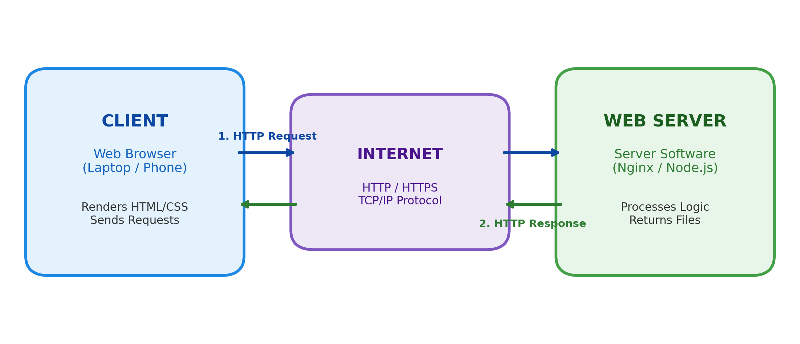
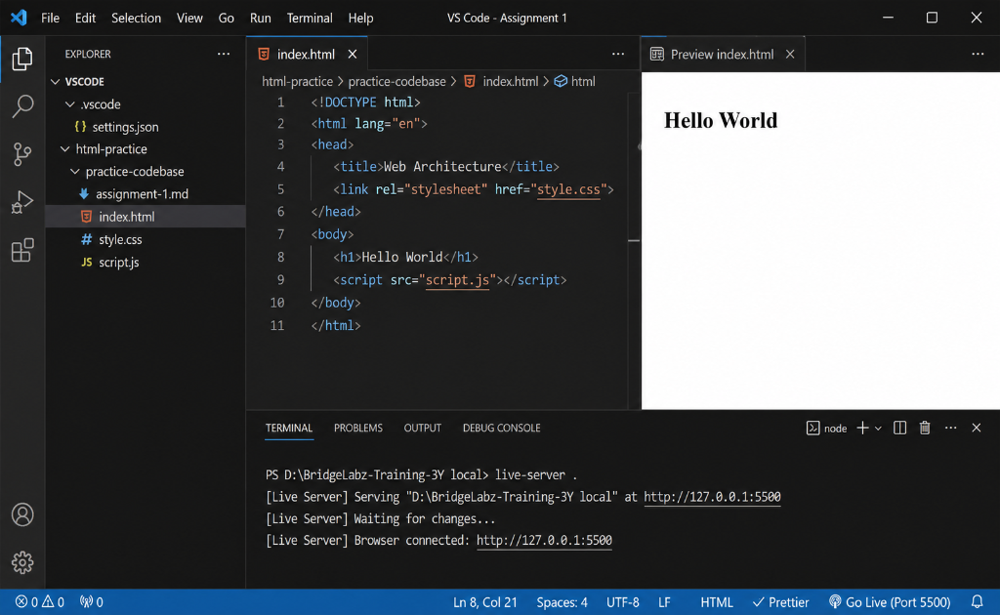
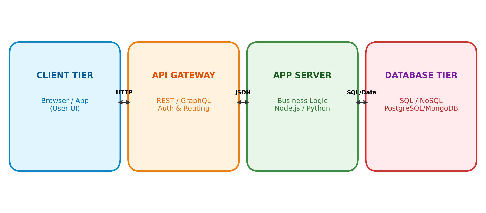

# Assignment 1: Web Development Fundamentals & Architecture

**Course / Module:** Web Development Fundamentals  
**Topic:** Frontend, Backend, Client-Server Architecture, Dev Tools, Web Browsers & Web Architecture  

---

## Question 1: Frontend, Backend, and Full-Stack Development

Web development is divided into three core focus areas based on where code runs and what part of the system it controls:

### 1. Frontend Development (Client-Side)
* **What it is:** Everything the user sees, clicks, and interacts with directly in their web browser. It focuses on visual layout, user experience (UX), and design responsiveness.
* **Technologies Used:** HTML5, CSS3, JavaScript, and modern frameworks like React or Vue.
* **Real-World Example:** On **Amazon**, the product search bar, image carousels, category filters, and "Add to Cart" button are built by frontend developers.

### 2. Backend Development (Server-Side)
* **What it is:** The unseen server-side engine running on remote servers. It handles server logic, process authentication, interacts with databases, and builds APIs.
* **Technologies Used:** Node.js, Python (Django/FastAPI), Java (Spring Boot), PHP, and databases (PostgreSQL, MongoDB, MySQL).
* **Real-World Example:** When you click "Place Order" on Amazon, the backend verifies your payment details, updates product stock in the database, and sends an order confirmation email.

### 3. Full-Stack Development
* **What it is:** Full-stack development combines both frontend and backend skills. A full-stack developer can build an entire web application end-to-end—from the user interface to the database storage.
* **Technologies Used:** Technology stacks like **MERN** (MongoDB, Express, React, Node.js) or **Next.js**.
* **Real-World Example:** A developer at a tech startup who creates both the React sign-up form UI and the Node.js authentication server logic.

### Quick Comparison Matrix

| Aspect | Frontend Development | Backend Development | Full-Stack Development |
| :--- | :--- | :--- | :--- |
| **Where Code Runs** | User Browser (Client) | Remote Server / Cloud Infrastructure | Both Client & Server |
| **Main Technologies** | HTML, CSS, JavaScript, React | Node.js, Python, Java, SQL, MongoDB | HTML, CSS, JS, Node.js, SQL |
| **Primary Focus** | User Interface & Experience | Business Logic, APIs & Databases | Complete End-to-End Application |
| **Real-World Analogy** | Restaurant dining area & menu | Kitchen, recipes & pantry storage | Head manager who cooks & serves |

---

## Question 2: The Client-Server Model in Web Architecture

The **Client-Server model** is a basic communication framework where work is divided between two main parties: the **Client** (requester) and the **Server** (provider).

* **Client:** The user's web browser (e.g., Chrome or Safari) that requests web pages or data.
* **Server:** A computer listening on the internet that receives requests, processes application logic, and returns webpage files or data.
* **Request-Response Cycle:** The client sends an HTTP Request over the network $\rightarrow$ The server receives & processes it $\rightarrow$ The server sends back an HTTP Response with status code `200 OK`.

### Client-Server Architecture Diagram

---

## Question 3: How a Browser Requests and Displays a Web Page

When you type a URL (e.g., `https://example.com`) into your browser and press `Enter`, the following steps occur in milliseconds:

1. **DNS Lookup:** The browser converts the domain name (`example.com`) into an IP address (e.g., `93.184.216.34`) by querying DNS servers.
2. **TCP/TLS Connection:** The browser opens a secure TCP socket connection using a 3-way handshake (`SYN` $\rightarrow$ `SYN-ACK` $\rightarrow$ `ACK`) and negotiates TLS/SSL encryption.
3. **Sending HTTP Request:** The browser sends an HTTP request (e.g., `GET /index.html HTTP/1.1`).
4. **Server Processing & Response:** The web server fetches `index.html` and returns an HTTP `200 OK` response containing the HTML content.
5. **Browser Rendering Pipeline:**
   * **DOM Construction:** Converts raw HTML bytes into a Document Object Model tree.
   * **CSSOM Construction:** Parses CSS rules into a style tree.
   * **Render Tree & Layout:** Merges DOM and CSSOM to compute visible positions and geometry.
   * **Painting:** Renders actual pixels, colors, text, and images onto your screen.

### Live Browser Demonstration

Below is the live environment demonstration showing a web browser requesting and displaying `index.html` via a local web server (`live-server` on `http://127.0.0.1:5500`):

---

## Question 4: Web Development Environment Tools

To build web applications efficiently, developers use a standard set of core tools:

1. **Code Editor (VS Code):** The primary text editor for writing code. Offers syntax highlighting, IntelliSense auto-complete, and extensions.
2. **Web Browser & DevTools (Google Chrome):** Renders web pages and includes Developer Tools to inspect HTML elements, debug CSS styles, and monitor JavaScript console errors.
3. **Version Control (Git & GitHub):** Tracks code history, manages branches, and allows team collaboration without overwriting code.
4. **Runtime & Package Manager (Node.js & npm):** Node.js runs JavaScript on your local machine outside the browser, while npm installs packages and libraries.
5. **Terminal / Command Line Interface:** Runs commands, starts local servers, and executes build scripts quickly.
6. **Local Development Server (Live Server):** Runs a local web server that auto-refreshes your browser immediately whenever you save a file.

---

## Question 5: What is a Web Server & Common Examples

A **Web Server** is a combination of hardware and software designed to serve web content over the internet:

* **Hardware Web Server:** A physical computer connected to the internet that stores website assets (HTML, CSS, images, databases).
* **Software Web Server:** A background program listening for HTTP requests on port 80/443, validating them, and serving requested files or API data.

### Commonly Used Web Servers
* **Nginx:** Lightweight, super-fast web server widely used for high-traffic websites and reverse proxying.
* **Apache HTTP Server:** Flexible, open-source traditional web server used globally in hosting environments.
* **Apache Tomcat:** Specialized Java servlet container for running Java EE web applications.
* **Microsoft IIS:** Windows-native web server built specifically for .NET and ASP.NET web applications.
* **Node.js (Express):** Event-driven server framework commonly used in modern full-stack JavaScript applications.

---

## Question 6: Roles in a Web Project: Frontend, Backend, and DBA

Modern project teams divide responsibilities among specialized roles:

1. **Frontend Developer:** Focuses on user experience (UX) and interface design. Converts mockups into responsive HTML/CSS/JS code and connects UI components to backend APIs.
2. **Backend Developer:** Focuses on server logic and business rules. Builds RESTful APIs, implements security/authentication, and connects the app to databases.
3. **Database Administrator (DBA):** Focuses on data safety and performance. Designs database tables, optimizes queries with indexing, performs backups, and manages security access controls.

### How They Work Together (e.g., User Registration Feature)
* **DBA:** Designs the `users` table schema in PostgreSQL/MySQL.
* **Backend Developer:** Builds the `/api/register` endpoint to hash passwords securely and save user records.
* **Frontend Developer:** Builds the sign-up form UI and sends form data to the backend API.

---

## Question 7: VS Code Setup Guide & Screenshot

Configuring Visual Studio Code for HTML, CSS, and JavaScript development requires a simple setup process:

### Setup Steps
1. Download VS Code installer from [code.visualstudio.com](https://code.visualstudio.com/).
2. Install essential extensions: **Live Server**, **Prettier - Code Formatter**, and **ESLint**.
3. Enable "Format on Save" and "Auto Save" in VS Code settings.

### Visual Representation & Screenshot

Below is the actual screenshot of the configured Visual Studio Code development setup:

* **Left Panel (Explorer):** Shows file structure containing `index.html`, `style.css`, `script.js`, and `settings.json`.
* **Center Panel (Editor):** Displays HTML5 code with linked `style.css` stylesheet and `script.js` file.
* **Right Panel (Live Preview):** Displays real-time preview rendering `Hello World`.
* **Bottom Panel (Terminal):** Shows `live-server` running connected on port 5500.

---

## Question 8: Static vs Dynamic Websites

Websites are categorized into Static or Dynamic based on how content is generated:

### 1. Static Websites
* **How They Work:** Deliver pre-written HTML files directly from the server. Every visitor receives identical content.
* **Characteristics:** Extremely fast, cheap to host, simple, no database required.
* **Real-World Example:** Personal portfolio, resume page, or restaurant menu page.

### 2. Dynamic Websites
* **How They Work:** Generate content on-the-fly at runtime using backend scripts and databases. Content changes dynamically based on user logins, parameters, or interactions.
* **Characteristics:** Interactive, personalized, uses databases and user accounts.
* **Real-World Example:** Amazon, Netflix, Twitter/X, or YouTube.

---

## Question 9: Web Browsers & Rendering Engines

A **Web Browser** retrieves web resources, while its internal **Rendering Engine** converts raw code into visual pixels on screen.

### Five Major Web Browsers & Their Engines

| Web Browser | Primary Rendering Engine | JavaScript Engine |
| :--- | :--- | :--- |
| **1. Google Chrome** | **Blink** (Chromium) | V8 |
| **2. Mozilla Firefox** | **Gecko** (Quantum) | SpiderMonkey |
| **3. Apple Safari** | **WebKit** | JavaScriptCore |
| **4. Microsoft Edge** | **Blink** (Chromium) | V8 |
| **5. Brave Browser** | **Blink** (Chromium) | V8 |

### How Rendering Engines Differ
* **Blink** focuses on high speed, multi-process tab sandboxing, and performance optimization.
* **Gecko** focuses on open web standards, user privacy, and parallel CSS rendering (built using Rust).
* **WebKit** focuses on battery efficiency and seamless GPU acceleration on Apple hardware.

---

## Question 10: Basic Web Architecture Flow

Modern web applications follow a clean multi-tier architecture flow:

### Labeled Architecture Flow Diagram

### Component Flow Breakdown
1. **Client Tier:** The web browser or mobile app that captures user interactions and sends HTTP requests.
2. **API Gateway:** Validates security tokens, handles rate-limiting, and routes requests to backend services.
3. **Application Server:** Executes backend code (Node.js/Python), applies business logic, and queries the database.
4. **Database Tier:** Stores data permanently using relational SQL (PostgreSQL, MySQL) or NoSQL (MongoDB).
